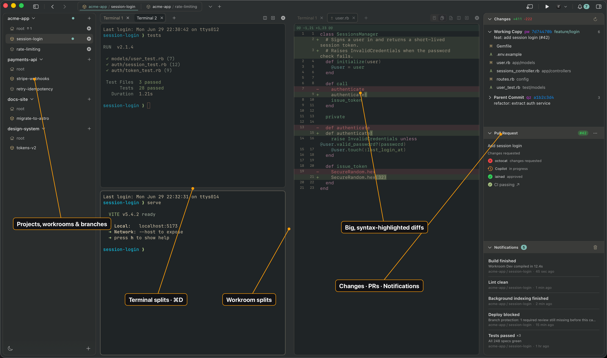

# Workroom

### Mission control for every branch you're running at once.

Spin up a workroom, get a terminal, get notified.

<p align="center">
  
</p>

<p align="center">
  <a href="https://github.com/joelmoss/workroom/releases"><strong>⬇&nbsp;&nbsp;Download for macOS (beta)</strong></a>
  &nbsp;·&nbsp;
  <a href="#installation">Install</a>
  &nbsp;·&nbsp;
  <a href="#architecture-overview">Architecture</a>
  &nbsp;·&nbsp;
  <a href="#local-development">Develop</a>
</p>

**Workroom is a native [macOS app](#the-macos-app) for running many copies of a project at once.**
Every project gets a sidebar; every workroom inside it gets its own persistent terminal. Spin a new
workroom up in one click, jump between their terminals freely without losing a running build or dev
server, and get notified the moment one finishes or needs your input — instead of hunting through a
wall of terminal tabs to find out.

Under the hood, a workroom is a full, isolated copy of your project — its own
[Git](https://git-scm.com/) worktree or [Jujutsu](https://martinvonz.github.io/jj/) workspace, so
you can work on several branches or features at the same time without stashing, switching, or
tripping over uncommitted changes. Workroom does all that bookkeeping for you (auto-detecting Git
vs JJ) and keeps your workrooms under a central directory (`~/workrooms` by default, configurable
via `workrooms_dir` in `~/.config/workroom/config.json`).

The app bundles and drives the same `workroom` engine that also ships as a
[standalone CLI](#the-cli-standalone) — handy for terminal-first workflows, and the only option on
Linux/Windows.

---

## Table of Contents

- [Key Features](#key-features)
- [What is a "workroom"?](#what-is-a-workroom)
- [Tech Stack](#tech-stack)
- [Prerequisites](#prerequisites)
- [The macOS app](#the-macos-app)
  - [Install](#install)
  - [What you get](#what-you-get)
- [The CLI (standalone)](#the-cli-standalone)
  - [Installation](#installation)
  - [Requirements](#requirements)
  - [CLI Usage](#cli-usage)
- [Setup and teardown scripts](#setup-and-teardown-scripts)
- [Architecture Overview](#architecture-overview)
  - [Repository layout](#repository-layout)
  - [The Go CLI engine](#the-go-cli-engine)
  - [How a workroom is created (lifecycle)](#how-a-workroom-is-created-lifecycle)
  - [How a workroom is deleted (lifecycle)](#how-a-workroom-is-deleted-lifecycle)
  - [VCS abstraction](#vcs-abstraction)
  - [The config file](#the-config-file)
  - [The `--json` machine contract](#the---json-machine-contract)
  - [The macOS app architecture](#the-macos-app-architecture)
- [Configuration & Environment Variables](#configuration--environment-variables)
- [Local Development](#local-development)
  - [Working on the Go CLI](#working-on-the-go-cli)
  - [Working on the macOS app](#working-on-the-macos-app)
  - [Available commands (`make`)](#available-commands-make)
- [Testing](#testing)
- [Deployment & Releases](#deployment--releases)
  - [Continuous integration](#continuous-integration)
  - [Cutting a release](#cutting-a-release)
  - [Required CI secrets](#required-ci-secrets)
  - [Release artifacts](#release-artifacts)
  - [The macOS app release pipeline](#the-macos-app-release-pipeline)
  - [Auto-update (Sparkle appcast)](#auto-update-sparkle-appcast)
- [Troubleshooting](#troubleshooting)
- [Contributing](#contributing)
- [License](#license)

---

## Key Features

- **Isolated project copies** — each workroom is a Git worktree or JJ workspace, so several
  branches/features run side by side without stashing or switching.
- **Automatic VCS detection** — Workroom detects Git vs Jujutsu and uses the right mechanism.
- **One-click create/delete** (in the app) or one command (in the CLI), with friendly auto-generated
  names like `swift-meadow`.
- **A persistent terminal per workroom** (app) powered by [libghostty](https://ghostty.org) — switch
  away and your dev server, build, or REPL keeps running.
- **Live activity & notifications** — tabs and sidebar rows animate while busy; desktop banners fire
  when a backgrounded terminal needs you.
- **Setup/teardown hooks** — run a project script automatically on create and delete.
- **A single engine, two front-ends** — the macOS app bundles the Go CLI and drives it over a
  machine-readable `--json` API; the CLI is also fully standalone (and the only option on
  Linux/Windows).
- **Self-updating** — the app updates itself via [Sparkle](https://sparkle-project.org); the CLI has
  a `workroom update` command.

---

## What is a "workroom"?

A **workroom** is an isolated, on-disk copy of your project that shares the same underlying
repository history but has its own working directory and its own branch/bookmark. It's implemented as:

- a **Git worktree** (`git worktree add`) when the project is a Git repo, or
- a **Jujutsu workspace** (`jj workspace add`) when the project is a JJ repo.

Workrooms live under a central directory (default `~/workrooms`) rather than next to the source repo,
each named after the generated workroom name (e.g. `~/workrooms/swift-meadow`). The branch/bookmark
created inside the VCS is namespaced `workroom/<name>` (e.g. `workroom/swift-meadow`).

This lets you have, say, three feature branches and a hotfix all checked out simultaneously — four
real directories, four terminals — without the constant `git stash` / `git switch` churn.

---

## Tech Stack

| Component | Technology |
| --- | --- |
| **CLI language** | Go 1.25+ (built/tested on Go 1.26) |
| **CLI framework** | [Cobra](https://github.com/spf13/cobra) for commands |
| **Interactive prompts** | [charmbracelet/huh](https://github.com/charmbracelet/huh) |
| **Colored output** | [fatih/color](https://github.com/fatih/color) |
| **VCS backends** | Git worktrees, Jujutsu (JJ) workspaces |
| **Config store** | JSON at `~/.config/workroom/config.json` |
| **macOS app language** | Swift 5 + SwiftUI (macOS 14 Sonoma+, Apple Silicon) |
| **Terminal engine** | [libghostty](https://ghostty.org) (`libghostty-spm` 1.2.x, Metal-rendered) |
| **App auto-update** | [Sparkle](https://sparkle-project.org) 2.6 (EdDSA-signed appcast) |
| **App crash reporting** | [Sentry](https://sentry.io) (optional, dSYM upload at release) |
| **App build tooling** | [XcodeGen](https://github.com/yonaskolb/XcodeGen) (`project.yml` → `.xcodeproj`) |
| **CLI release tooling** | [GoReleaser](https://goreleaser.com) v2 |
| **CI/CD** | GitHub Actions (CI on push/PR, release on `v*` tags) |

---

## Prerequisites

**To use the macOS app:** nothing — the `.dmg` is self-contained (the CLI is bundled inside it).
macOS 14 Sonoma or later on Apple Silicon.

**To use the standalone CLI:** [Git](https://git-scm.com/) or [JJ (Jujutsu)](https://martinvonz.github.io/jj/)
on your `PATH`. That's it for installed-binary use.

**To develop on the project:**

- **Go 1.25+** (the module targets `go 1.25.7`; CI and the maintainer build with Go 1.26) — for the CLI.
- **Xcode 15+** with the macOS 14 SDK — for the app.
- **[XcodeGen](https://github.com/yonaskolb/XcodeGen)** (`brew install xcodegen`) — the `.xcodeproj`
  is generated from `macapp/project.yml`, not checked in.
- **`jj`** (`brew install jj`) — needed for the app's VCS integration tests, and if you develop in this
  repo itself (it is a colocated Git+JJ repo).
- **`golangci-lint` v1.x** — for `make cli-lint`: `go install github.com/golangci/golangci-lint/cmd/golangci-lint@latest`.
- **`gh` ≥ 2.57.0** (runtime, not build) — the app's PR/CI inspector shells out to the GitHub CLI.

---

## The macOS app

> **🚧 Beta.** The macOS app is young and under active development — expect rough edges, and some
> flows still want polish. [Bug reports and feedback](https://github.com/joelmoss/workroom/issues)
> are very welcome.

The native app (macOS 14 Sonoma or later, Apple Silicon) is a home for every project you work on
and every workroom inside it. Pick a workroom in the sidebar, get a real terminal already `cd`'d
into it, and run whatever you like — Workroom keeps each one alive and out of the others' way.

### Install

Download the latest `workroom-macos-app_<version>.dmg` from the
[Releases page](https://github.com/joelmoss/workroom/releases) — the newest build is at the top
(the app currently ships as a `v2.0.0-beta` prerelease) — open it, and drag
**Workroom** into Applications. The app is Developer ID-signed and notarized, so it launches with
no Gatekeeper warning — and it **updates itself** in the background (or on demand via
*Workroom ▸ Check for Updates…*).

That's the whole install. The `workroom` CLI is bundled inside the app and driven for you, so
there's nothing else to download. Want the command in your own shell too? *Workroom ▸ Install
'workroom' Command in PATH…* symlinks it into your `PATH` (prompting for admin once if needed).

Building from source instead? See [Working on the macOS app](#working-on-the-macos-app)
and [`macapp/README.md`](macapp/README.md) (`make app-run`).

### What you get

**A sidebar of everything you're working on.** Each project expands into its workrooms as a tree,
and every row shows its current Git branch or JJ bookmark inline — with an "ahead of upstream"
marker and a warning when a folder has gone missing. Add a project, expand/collapse it, and pick a
target; your layout, selection, and expansion state are remembered across launches.

**A live terminal in every workroom.** Selecting a workroom gives you an embedded terminal (powered
by [libghostty](https://ghostty.org)) already in the right directory. Each workroom keeps **its own
terminal alive for the session** — switch away to another workroom and your dev server, build, or
REPL keeps running, ready exactly as you left it when you come back. Open as many terminals per
target as you want in a draggable tab strip; tabs label themselves with the running command or
working directory.

**See work happening at a glance.** While a command runs, the tab and its sidebar row animate so
you can tell what's busy without switching to it. When a backgrounded terminal posts a notification,
its tab and project light up, and — if Workroom isn't the frontmost app — you get a desktop banner.
A notifications inspector keeps the history; click any entry (or the banner) to jump straight to the
terminal that raised it.

**Create and delete without touching the command line.** Hit the **+** on a project to spin up a
new workroom. Your `scripts/workroom_setup` runs behind a live progress overlay so you watch
dependencies install and config copy in real time, and the terminal opens only once setup is done.
Deleting is a hover-to-trash with a confirmation; teardown runs in the background and the row clears
immediately. (See [Setup and teardown scripts](#setup-and-teardown-scripts).)

**Jump in with the keyboard.** `⌘1`–`⌘9` focus terminals left-to-right, `⌘T` opens a new one, `⌘W`
closes the active one (with an optional confirm), and `⌘O` adds a project. A global `⌘§` hotkey
shows or hides Workroom from anywhere.

**Stay in your editor.** `⌘`-click a file path in any terminal to open it in your editor — VS Code,
Zed, or Xcode — at the right working directory. The detail toolbar also has *Open in…*, *Reveal in
Finder*, and *Copy Path* for the selected workroom.

**Make it yours.** System / Light / Dark theming (terminals re-theme live), copy-on-select,
confirm-before-quit and confirm-before-close toggles, and an editor preference all live in
Preferences (`⌘,`).

---

## The CLI (standalone)

Prefer the terminal, or running on Linux/Windows? The `workroom` CLI does everything on its own.
(Skip this entirely if you use the macOS app — it already bundles the CLI and drives it for you.)

### Installation

**macOS / Linux:**

```bash
curl -fsSL https://raw.githubusercontent.com/joelmoss/workroom/master/install.sh | sh
```

**Windows (PowerShell):**

```powershell
iwr https://raw.githubusercontent.com/joelmoss/workroom/master/install.ps1 -useb | iex
```

**Install a specific version:**

```bash
VERSION=v1.2.0 curl -fsSL https://raw.githubusercontent.com/joelmoss/workroom/master/install.sh | sh
```

**Override install location (macOS / Linux):**

By default, the binary is installed to `~/.local/bin`. Set `WORKROOM_INSTALL_PATH` to change this:

```bash
WORKROOM_INSTALL_PATH=/usr/local/bin curl -fsSL https://raw.githubusercontent.com/joelmoss/workroom/master/install.sh | sh
```

The install script auto-detects your OS (`darwin`/`linux`) and architecture (`amd64`/`arm64`),
fetches the matching release archive, unpacks the binary, and (if your install dir isn't on `PATH`)
prints the `export PATH=…` line to add to your shell profile.

#### Alternative methods

**Via Go:**

```bash
go install github.com/joelmoss/workroom@latest
```

**Build from source:**

```bash
git clone https://github.com/joelmoss/workroom.git
cd workroom
make cli-build      # produces ./workroom with the version injected via ldflags
```

### Requirements

- [JJ (Jujutsu)](https://martinvonz.github.io/jj/) or [Git](https://git-scm.com/)

### CLI Usage

#### Create a workroom

```bash
workroom create
```

A random friendly name (e.g. `swift-meadow`) is auto-generated from a 120-adjective × 210-noun word
list. Workroom automatically detects whether you're using JJ or Git and uses the appropriate
mechanism (JJ workspace or Git worktree). If the generated name collides, it retries up to 5 times,
then falls back to appending a random 2-digit suffix (e.g. `swift-meadow-42`).

Alias: `workroom c`. Flags: `--project <dir>` (operate on a directory other than the cwd),
`--no-editor` (suppress the post-create "open in `$EDITOR`?" prompt).

#### List workrooms

```bash
workroom list
```

Lists all workrooms for the current project. When run from outside a known project, lists all
workrooms grouped by parent project. When run from inside a workroom, shows the parent project path.
Rows flag warnings such as a missing directory or a missing VCS workspace.

Aliases: `workroom ls`, `workroom l`

#### Delete a workroom

```bash
workroom delete my-feature
```

Removes the workspace/worktree and cleans up the directory. You'll be prompted for confirmation
before deletion.

When run without a name, an interactive multi-select menu is shown, allowing you to pick one or more
workrooms to delete:

```bash
workroom delete
```

To skip the confirmation prompt (useful for scripting), pass `--confirm` with the workroom name:

```bash
workroom delete my-feature --confirm my-feature
```

> **Note on Git:** deleting a workroom removes the worktree and its directory but **does not** delete
> the underlying `workroom/<name>` branch. Workroom prints the `git branch -D` command to run if you
> want it gone.

Alias: `workroom d`

#### Update the CLI

```bash
workroom update          # download & install the latest release
workroom update --check  # only report whether an update is available
```

(Dev builds can't self-update — install from a release first.)

#### Print the version

```bash
workroom version
```

#### Global Options

- `-v`, `--verbose` — Print detailed, step-by-step output.
- `-p`, `--pretend` — Run through the command without making changes (dry run).
- `--json` — Emit a single machine-readable JSON object on stdout (see
  [the `--json` contract](#the---json-machine-contract)). Used by the macOS app.
- `--confirm NAME` — (delete only) Skip confirmation when `NAME` matches the workroom being deleted.

---

## Setup and teardown scripts

Both the macOS app **and** the CLI automatically run user-defined scripts during create and delete
operations — the app drives the same engine, so the same hooks work no matter how you use Workroom.

### Setup script

Place an executable script at `scripts/workroom_setup` in your project (remember `chmod +x`). It
runs **inside the new workroom** right after creation — a good place to install dependencies and
pull in gitignored local config that the worktree/workspace doesn't carry over. (In the macOS app,
its output streams into the setup overlay as it runs.)

```bash
#!/usr/bin/env bash
set -euo pipefail

# A fresh workroom is a clean checkout, so copy gitignored local config (e.g. .env)
# from the root project this workroom belongs to.
cp "$WORKROOM_ROOT_PATH/.env" .env 2>/dev/null || true

# Install dependencies for this isolated copy.
npm install

# Give the workroom its own database, named after it, so it can't clobber others.
createdb "myapp_${WORKROOM_NAME}"
```

> A setup failure is **not** transactional: the workroom directory and config entry already exist
> by the time setup runs. The CLI reports the failure (exit code 5); the macOS app surfaces the
> error and offers to delete the half-created workroom.

### Teardown script

Place an executable script at `scripts/workroom_teardown` in your project (`chmod +x`). It runs
**inside the workroom** just before it's deleted — undo anything setup created that lives outside
the workroom (the directory itself is removed for you):

```bash
#!/usr/bin/env bash
set -euo pipefail

# Drop the per-workroom database that setup created.
dropdb "myapp_${WORKROOM_NAME}" 2>/dev/null || true
```

### Environment variables

The same environment variables are available to **both** the setup and teardown scripts. The script
runs with its **working directory set to the workroom directory**.

| Variable | Meaning |
| --- | --- |
| `WORKROOM_NAME` | The name of the workroom being created or deleted. |
| `WORKROOM_PATH` | Absolute path to the workroom directory (also the script's working directory). |
| `WORKROOM_ROOT_PATH` | Absolute path to the root project the workroom belongs to. Since scripts run inside the workroom, this lets you reference files back in the original project. |
| `WORKROOM_PARENT_DIR` | _Deprecated_ alias for `WORKROOM_ROOT_PATH`, still set for existing scripts. Prefer `WORKROOM_ROOT_PATH`. |

This repo ships its own `scripts/workroom_setup` as a working example: it guards against the root
and workroom paths resolving to the same inode (which would clobber source) and copies
`.claude/settings.local.json` into the new workroom.

---

## Architecture Overview

Workroom is two front-ends over **one engine**. The engine is the Go CLI; the macOS app is a
SwiftUI client that bundles the CLI binary and drives it over a stable `--json` contract — no cgo,
no duplicated VCS logic.

```
┌──────────────────────────────┐        ┌──────────────────────────────┐
│  macOS app (Swift / SwiftUI)  │        │   You, in a terminal          │
│  macapp/                      │        │                               │
└───────────────┬──────────────┘        └───────────────┬──────────────┘
                │  spawns bundled binary                 │  runs installed binary
                │  `workroom … --json`                   │  `workroom …`
                ▼                                         ▼
        ┌────────────────────────────────────────────────────────┐
        │                  The workroom Go engine                 │
        │  cmd/  (Cobra commands)                                 │
        │  internal/workroom/  (create / delete / list orchestr.) │
        │  internal/vcs/  ──►  Git worktrees  |  JJ workspaces     │
        │  internal/config/  ──►  ~/.config/workroom/config.json   │
        │  internal/script/  ──►  setup / teardown hooks           │
        └────────────────────────────────────────────────────────┘
```

### Repository layout

```
workroom/
├── main.go                  # Entry point; injects version via ldflags, calls cmd.Execute()
├── cmd/                     # Cobra command definitions
│   ├── root.go              # Root command, global flags, Service construction
│   ├── create.go            # `workroom create` (alias c)
│   ├── list.go              # `workroom list` (aliases ls, l)
│   ├── delete.go            # `workroom delete` (alias d)
│   ├── update.go            # `workroom update` (alias u) — CLI self-update
│   ├── version.go           # `workroom version`
│   ├── add_project.go       # Hidden; --json only; used by the app to register a project
│   ├── delete_project.go    # Hidden; --json only; used by the app to drop a project
│   ├── json.go              # --json success/error envelope writers
│   ├── jsonlog.go           # NDJSON streaming of setup/teardown output (stderr)
│   └── helpers.go           # cwd / --project resolution
├── internal/
│   ├── config/              # JSON config CRUD (atomic writes + advisory lock)
│   ├── namegen/             # Adjective-noun name generation (120 × 210)
│   ├── vcs/                 # VCS interface + Git/JJ impls + CommandExecutor (testable)
│   ├── workroom/            # Core orchestration: Service.{Create,Delete,List,ListData}
│   ├── script/              # Setup/teardown script runner (env vars + live streaming)
│   ├── ui/                  # Colored output, tables, log panels, interactive prompts (huh)
│   ├── updater/             # `workroom update`: GitHub release check + binary swap
│   └── errs/                # Shared error sentinels + machine codes + exit codes
├── macapp/                  # The macOS app (SwiftUI) — see macapp/CLAUDE.md & macapp/README.md
├── scripts/workroom_setup   # This repo's own example setup hook
├── testdata/fixtures/       # Setup/teardown scripts used by Go tests
├── .github/workflows/       # CI + release + appcast automation
├── .goreleaser.yml          # CLI cross-platform build/release config
├── .golangci.yml            # Linter config
├── install.sh / install.ps1 # Standalone CLI installers
└── Makefile                 # Dev tasks: cli-* (Go) and app-* (macОС app)
```

### The Go CLI engine

Everything routes through `cmd.Execute()` (called from `main.go`). The root command sets up the
persistent flags (`--verbose`, `--pretend`, `--json`) and `SilenceUsage`/`SilenceErrors` so Workroom
renders its own error format. Each subcommand builds a `workroom.Service` via `newService()`:

```go
// internal/workroom/workroom.go
type Service struct {
    Config         *config.Config
    VCS            vcs.VCS
    Out            io.Writer
    Verbose        bool
    Pretend        bool
    PromptFn       PromptFunc   // interactive multi-select (huh)
    ConfirmFn      ConfirmFunc  // interactive yes/no (huh)
    // ... plus test-injection hooks and --json wiring (SuppressEditor,
    //     KeepEmptyProject, ScriptLogWriter, OnReady)
}
```

In `--json` mode, `newService()` swaps the human pieces for machine-safe ones: output is discarded
(the command writes the JSON itself), the editor prompt is suppressed, empty projects are pinned,
and the interactive prompt/confirm hooks return errors rather than blocking. This is how the same
`Service` serves both the interactive terminal and the GUI.

`Service` methods (`Create`, `CreateNamed`, `Delete`, `InteractiveDelete`, `List`, `ListData`) hold
the orchestration logic and delegate VCS work to the `vcs.VCS` interface, persistence to
`config.Config`, and hook execution to `script.Run`.

### How a workroom is created (lifecycle)

`Service.CreateNamed` (the machine path; `Service.Create` wraps it for humans with a log panel and
the editor prompt):

1. **Guard:** reject if the cwd is already a workroom (presence of a `.Workroom` marker).
2. **Detect VCS:** `vcs.Detect(dir)` looks for `.jj` then `.git` and returns a `JJ` or `Git` impl.
3. **Generate a unique name:** try `namegen.Generate()` up to 5 times; on persistent collision,
   append a random 2-digit suffix (up to 10 more tries).
4. **Collision checks:** ensure the VCS workspace and the target directory don't already exist.
5. **Create the workspace:** `mkdir -p ~/workrooms`, then `git worktree add -b workroom/<name> <path>`
   or `jj workspace add <path> --name workroom/<name>`.
6. **Persist:** `config.AddWorkroom(...)` records `{path}` under the project, keyed by project path,
   with the VCS type.
7. **Signal readiness:** fire `OnReady` (the app mounts the workroom and starts streaming the setup
   log) before the potentially slow setup script runs.
8. **Run setup:** if `scripts/workroom_setup` exists, `script.Run("setup", …)` executes it inside the
   new workroom with the [environment variables](#environment-variables), streaming combined
   stdout/stderr live.

Creation is **not transactional**: if setup fails, the workspace and config entry already exist, so
the returned `CreateResult` is populated even on error — callers can report "created, but setup
failed" and offer cleanup.

### How a workroom is deleted (lifecycle)

`Service.Delete` → `deleteByName`:

1. **Guard + validate** the name against `^[a-zA-Z0-9]([a-zA-Z0-9_-]*[a-zA-Z0-9])?$`.
2. **Confirm** (interactively, or via a matching `--confirm <name>` value).
3. **Run teardown:** if `scripts/workroom_teardown` exists, run it inside the workroom (streaming).
4. **Remove the workspace:** `git worktree remove <path> --force` or `jj workspace forget workroom/<name>`.
   For JJ, the directory is also `os.RemoveAll`'d (Git's `worktree remove` already does this).
   **Branches/bookmarks are intentionally left intact** in both cases.
5. **Update config:** remove the workroom entry. If it was the project's last workroom, the project
   is dropped too — unless `KeepEmptyProject` is set (the app pins empty projects in its sidebar).

### VCS abstraction

`internal/vcs` hides Git vs JJ behind one interface:

```go
type VCS interface {
    Type() Type                                  // "git" | "jj"
    Label() string                               // human label
    WorkroomExists(dir, name string) (bool, error)
    Create(dir, vcsName, path string) (string, error)
    Delete(dir, vcsName, path string) (string, error)
    ListWorkrooms(dir string) ([]string, error)
}
```

All shell-outs go through a `CommandExecutor` (`RealExecutor` in production, a mock in tests), which
makes the orchestration fully unit-testable without touching a real repo. `vcs.Detect` is used when
creating/deleting (it touches the filesystem); `vcs.New(type)` reconstructs a VCS from the stored
config type string for listing, without requiring the project directory to exist.

### The config file

`~/.config/workroom/config.json` is the single source of truth, shared by the CLI and the app. Shape:

```json
{
  "workrooms_dir": "~/workrooms",
  "/Users/you/dev/myapp": {
    "vcs": "git",
    "workrooms": {
      "swift-meadow": { "path": "/Users/you/workrooms/swift-meadow" },
      "calm-harbor":  { "path": "/Users/you/workrooms/calm-harbor" }
    }
  }
}
```

- Top-level keys are **canonical, symlink-resolved absolute project paths** (so the same project via
  a symlink or trailing slash maps to one entry). `workrooms_dir` is a reserved key.
- Writes are **atomic** (write to a temp file, `fsync`, then `rename`) so a concurrent reader never
  sees a partial file.
- Read-modify-write cycles are guarded by a **best-effort cross-process advisory lock**
  (`config.json.lock`) so the standalone CLI and the app's bundled binary don't clobber each other;
  it degrades to running unlocked rather than failing, and steals locks left by crashed processes
  after 10s.

### The `--json` machine contract

Every `--json` invocation prints **exactly one JSON object on stdout** (the result envelope) and
exits with a [stable code](#exit-codes). Progress (setup/teardown logs) streams as
**NDJSON on stderr**, so stdout stays a single object.

**Success envelope:**

```json
{ "ok": true, "schema_version": 1, "cli_version": "v2.0.0-beta.1",
  "command": "create", "name": "swift-meadow", "path": "/Users/you/workrooms/swift-meadow",
  "vcs": "git", "project": "/Users/you/dev/myapp" }
```

**Error envelope** (machine code + human message):

```json
{ "ok": false, "schema_version": 1, "cli_version": "v2.0.0-beta.1",
  "command": "create", "error": { "kind": "WorkspaceExists", "message": "Git worktree already exists: …" } }
```

**Streaming log event (stderr, one per line):**

```json
{ "type": "log", "phase": "setup", "text": "npm install…" }
```

`create --json` also emits an early `{"type":"created", …}` event on stderr the moment the workroom
exists (before setup runs), so a GUI can mount it and dock the streaming setup log immediately.

**Commands available in `--json` mode:** `create`, `list` (with `--warnings none|fast|full`),
`delete` (requires `--confirm <name>`), `version`, plus two hidden, app-only commands — `add-project`
(register an empty project) and `delete-project` (drop a project; `--with-workrooms` cascades the
teardown). The schema is versioned (`schema_version: 1`); breaking changes bump it.

#### Error codes

`internal/errs` maps each sentinel error to a stable `kind` string used in the JSON contract:

| `kind` | Meaning |
| --- | --- |
| `InWorkroom` | Command run from inside an existing workroom |
| `UnsupportedVCS` | No Git or JJ repo detected |
| `InvalidName` | Workroom name failed validation |
| `DirExists` / `WorkspaceExists` | Target dir / VCS workspace already exists |
| `WorkspaceNotFound` | Workroom to delete doesn't exist |
| `ConfirmationMismatch` | `--confirm` value didn't match |
| `Cancelled` | User aborted / no-op |
| `SetupScriptFailed` / `TeardownScriptFailed` | Hook returned non-zero |
| `ConfigReadFailed` / `ConfigWriteFailed` | Config I/O / parse error |
| `VCSCommandFailed` | Underlying `git`/`jj` command failed |
| `InternalError` | Anything else |

#### Exit codes

Non-interactive callers can branch on the process exit code:

| Code | Class |
| --- | --- |
| `0` | Success |
| `2` | Usage / validation (e.g. confirmation mismatch) |
| `3` | Domain precondition / not-found (unsupported VCS, exists, invalid name, in-workroom) |
| `4` | Cancelled / no-op |
| `5` | Setup / teardown script failed |
| `6` | Config read / write / parse error |
| `1` | Internal error |

### The macOS app architecture

The app (`macapp/`, see [`macapp/CLAUDE.md`](macapp/CLAUDE.md)) is a value-based, **multi-window**
SwiftUI app. The core loop:

1. **Sidebar selection** (project / root / workroom) sets `AppStore.selectedTargetID`.
2. **Opening a target** creates a libghostty terminal surface (`GhosttySurfaceView`), caches it in
   `TerminalSessions` keyed by target, and renders it in the detail pane. One live terminal per
   target persists for the session.
3. **Terminal I/O** surfaces libghostty/OSC callbacks app-wide — title (OSC 0/2), command-finished
   (OSC 133), busy/progress (OSC 9;4), and notifications (OSC) drive tab/sidebar animation, badges,
   the inspector, and desktop banners.
4. **Mutations** (create/delete workroom, add/remove project) call the bundled CLI via
   `WorkroomCLI` (a `Process` wrapper that locates `Workroom.app/Contents/Resources/workroom`,
   overlays `PATH`, drains stdout/stderr concurrently, streams NDJSON logs, and decodes the JSON
   envelope), then update the store on success.
5. **State** splits into a shared `ProjectStore` (the one project list + derived branch/status data)
   and a per-window `AppStore` (selection, terminals, splits) — so multiple windows share projects
   but keep independent layouts. `WindowRegistry` tracks open windows.
6. **Preferences** live in `DefaultsKeys` (via the `Defaults` library); **auto-update** is Sparkle
   (`Updater`); **themes** load from bundled CSS theme families.

Key dependencies: **libghostty-spm** (terminal), **Sparkle** (update), **Sentry** (crash reporting),
**Defaults** (preferences), and **SwiftTreeSitter** + grammars (syntax highlighting). The app is
**non-sandboxed** with the **hardened runtime** enabled (it spawns `git`/`jj`/`workroom` and opens
arbitrary directories), and registers a global `⌘§` hotkey via Carbon. The embedded Go helper is
built and signed during the Xcode build by `macapp/Scripts/build-helper.sh` and placed under
`Contents/Resources/` (not `Contents/MacOS/`, to avoid a case-insensitive collision with `Workroom`).

---

## Configuration & Environment Variables

Workroom has no required environment for normal use. The relevant variables:

| Variable | Used by | Purpose |
| --- | --- | --- |
| `WORKROOM_INSTALL_PATH` | `install.sh` | Override the CLI install directory (default `~/.local/bin`). |
| `VERSION` | `install.sh` / `install.ps1` | Install a specific CLI version instead of the latest. |
| `EDITOR` | `workroom create` | If set (and not `--no-editor`/`--json`), Workroom offers to open the new workroom in it. |
| `WORKROOM_NAME`, `WORKROOM_PATH`, `WORKROOM_ROOT_PATH` | setup/teardown scripts | See [Environment variables](#environment-variables). Set by Workroom, not by you. |

**Config file:** `~/.config/workroom/config.json`. The only user-editable key is
`workrooms_dir` (where workrooms are created; default `~/workrooms`, supports a leading `~`). Everything
else is managed by Workroom.

---

## Local Development

Dev tasks run through the **repo-root `Makefile`**, namespaced `cli-*` (Go CLI) and `app-*` (macOS
app). Run `make` with no target to list everything.

### Working on the Go CLI

```bash
# Build the binary (version injected from git tags via ldflags)
make cli-build              # → ./workroom

# Run the full test suite
make cli-test               # go test ./...
go test ./internal/workroom/ -v   # one package, verbose

# Lint (golangci-lint v1.x — see Prerequisites)
make cli-lint

# Install into $GOBIN
make cli-install

# Remove the built binary
make cli-clean
```

Raw Go also works: `go build -o workroom .`, `go test ./...`. The version string defaults to `dev`
when built without ldflags (which disables `workroom update`).

**Where to make changes:**

- A new subcommand → add a file under `cmd/` and register it in its `init()`.
- New orchestration logic → `internal/workroom/`.
- A new VCS operation → extend the `vcs.VCS` interface and both `git.go` / `jj.go`.
- A new config field → `internal/config/config.go`.
- A new error class → add a sentinel in `internal/errs/errs.go` and map it in `Code`/`ExitCode`.

Because all shell-outs go through `vcs.CommandExecutor`, orchestration is testable with a mock
executor and a temp config — no real repo required.

### Working on the macOS app

The app is built with [XcodeGen](https://github.com/yonaskolb/XcodeGen): the `.xcodeproj` is
generated from `macapp/project.yml` and **gitignored**, so you regenerate it rather than editing it.

```bash
# Fastest loop: generate (if needed) → build (Debug) → relaunch the dev app
make app-run

# Build / test / lint / format
make app-build
make app-test           # WorkroomAppTests (unit, headless)
make app-uitest         # WorkroomAppUITests (XCUITest — needs a real GUI login session)
make app-lint           # swift-format --strict
make app-format         # swift-format, rewrite in place
make app-generate       # force-regenerate the .xcodeproj from project.yml

# Open in Xcode instead
cd macapp && xcodegen generate && open WorkroomApp.xcodeproj   # then ⌘R
```

The Debug product is **"Workroom Dev"** — a distinct bundle id (`…workroom.dev`) and name, with an
amber icon — so it runs alongside the installed release "Workroom" without conflict. It shares the
same `~/.config/workroom/config.json`, but skips the global `⌘§` hotkey and Sparkle scheduled checks
so it doesn't interfere with your real install.

> **Adding/removing Swift files** requires regenerating the project (`make app-generate`), since the
> file list lives in the generated `.xcodeproj`.

The Xcode build runs `macapp/Scripts/build-helper.sh` as a phase, which compiles the Go CLI and
embeds it in the app bundle — so a Go toolchain must be on `PATH` when building the app. See
[`macapp/README.md`](macapp/README.md) and [`macapp/CLAUDE.md`](macapp/CLAUDE.md) for the full
architecture, the libghostty integration notes (`macapp/QA-libghostty.md`), and signing details.

### Available commands (`make`)

| Target | What it does |
| --- | --- |
| `make` | List all targets |
| `cli-build` | Build `./workroom` with version injected |
| `cli-test` | `go test ./...` |
| `cli-install` | `go install` into `$GOBIN` |
| `cli-lint` | `golangci-lint run` |
| `cli-clean` | Remove the built binary |
| `app-run` | Build (Debug) and relaunch the dev app |
| `app-build` | Build the app (Debug) |
| `app-test` | Run `WorkroomAppTests` (unit) |
| `app-uitest` | Run `WorkroomAppUITests` (XCUITest; needs a GUI session) |
| `app-generate` | Regenerate the `.xcodeproj` from `project.yml` |
| `app-format` / `app-lint` | Format / lint Swift via swift-format |
| `app-release` | Build → sign → notarize → staple → DMG (full release) |
| `app-icon` | Regenerate the AppIcon PNGs |
| `app-clean` | Remove `DerivedData` + the `.xcodeproj` |

---

## Testing

**Go CLI** — standard `go test`. Coverage spans config CRUD, name generation, the VCS Git/JJ parsers
(with a mock `CommandExecutor`), the script runner (using `testdata/fixtures/{setup,teardown,failed_setup,failed_teardown}`),
the updater's version comparison, and the full create/delete/list/`list_data` orchestration plus the
`delete-project` command (unit + integration).

```bash
make cli-test                       # everything
go test ./internal/workroom/ -v     # one package, verbose
go test -run TestCreate ./...       # a single test by name
```

**macOS app** — two suites:

- **`WorkroomAppTests/`** — host-based unit tests (`@testable import Workroom`) covering app logic:
  the AppStore, tab/split math, navigation history, notification routing, diff resolution, run
  commands, multi-window behavior, and the CLI bridge. Run with `make app-test` (headless).
- **`WorkroomAppUITests/`** — XCUITest workflows driven through the accessibility tree (sidebar,
  tabs, menus, diffs). Run with `make app-uitest`. These need a **real GUI login session** (not a
  headless runner), and the Metal-rendered terminal content isn't in the a11y tree, so they exercise
  the app shell rather than terminal output.

> On Xcode 26, the test summary can be hidden; read pass/fail from the `.xcresult` via
> `xcresulttool` if `make app-test` looks quiet.

---

## Deployment & Releases

There is no server to deploy — Workroom is a desktop app plus a CLI distributed through **GitHub
Releases**. "Deployment" here means cutting a release: GitHub Actions builds and publishes both
components automatically when you push a version tag.

### Continuous integration

`.github/workflows/ci.yml` runs on every push to `master` and every PR against it:

- **`cli` job** (`ubuntu-latest`): sets up Go from `go.mod`, runs `golangci-lint` (subsumes `go vet`
  / `gofmt`), `go build`, and `go test ./...`.
- **`app` job** (`macos-15`): sets up Xcode + Go, `brew install xcodegen jj`, runs `make app-lint`
  (swift-format `--strict`) and `make app-test` with **ad-hoc signing** flags (hosted runners have
  no signing cert), e.g.:

  ```
  CODE_SIGN_IDENTITY=- CODE_SIGNING_REQUIRED=NO DEVELOPMENT_TEAM=
  ```

### Cutting a release

Releases are **tag-driven**. Push a `v*` tag and `.github/workflows/release.yml` does the rest:

```bash
git tag v1.4.0
git push origin v1.4.0
```

A clean `vX.Y.Z` tag publishes as a normal ("Latest") release; a tag with a prerelease component
(e.g. `v2.0.0-beta.1`, `v1.4.0-rc1`) is auto-marked as a GitHub **pre-release** so it never becomes
"Latest" (GoReleaser `prerelease: auto`).

You can test the CLI build locally with [GoReleaser](https://goreleaser.com/) before tagging
(produces binaries in `dist/` without publishing):

```bash
goreleaser build --snapshot --clean
```

**After a release publishes, curate its GitHub release notes** — replace GoReleaser's raw commit
list with a succinct, themed summary (a headline, a one-line framing, and grouped bullets). Editing
the release notes also triggers `appcast-notes.yml`, which re-renders the Sparkle update dialog's
notes from your curated body.

### Required CI secrets

The CLI release needs only the default `GITHUB_TOKEN`. The macOS app release (the `macapp` job) needs
Apple signing/notarization credentials (plus optional Sparkle/Sentry):

| Secret | Purpose |
| --- | --- |
| `MACOS_CERTIFICATE` | Base64-encoded Developer ID Application `.p12` |
| `MACOS_CERTIFICATE_PWD` | Password for the `.p12` |
| `KEYCHAIN_PASSWORD` | Password for the temporary build keychain |
| `NOTARY_KEY` | Base64-encoded App Store Connect API key (`.p8`) |
| `NOTARY_KEY_ID` | App Store Connect API key ID |
| `NOTARY_ISSUER_ID` | App Store Connect issuer ID |
| `SPARKLE_PRIVATE_KEY` | _(optional)_ EdDSA key to sign the DMG for the appcast |
| `SENTRY_AUTH_TOKEN` / `SENTRY_ORG` / `SENTRY_PROJECT` | _(optional)_ dSYM upload to Sentry |

> If the notarization job fails with a `403` / "agreement missing or expired", that's an Apple
> account gate — accept the latest agreement at developer.apple.com, then `gh run rerun <id> --failed`.

### Release artifacts

Each release publishes both components:

| Artifact | Pattern | Example |
| --- | --- | --- |
| CLI archive (macOS/Linux) | `workroom_<version>_<os>_<arch>.tar.gz` | `workroom_1.4.0_darwin_arm64.tar.gz` |
| CLI archive (Windows) | `workroom_<version>_windows_<arch>.zip` | `workroom_1.4.0_windows_amd64.zip` |
| macOS app installer | `workroom-macos-app_<version>.dmg` | `workroom-macos-app_1.4.0.dmg` |
| Sparkle feed | `appcast.xml` | published to a fixed `appcast` release |

GoReleaser builds the CLI for `darwin`/`linux`/`windows` × `amd64`/`arm64` with
`CGO_ENABLED=0` and `-s -w -X main.version=<tag>`. The archive name (`workroom_<version>_…`) is what
`install.sh` and `internal/updater/updater.go` download, so the GoReleaser `name_template` and those
two paths must stay in lockstep — a rename in one without the others breaks `curl | sh` and
`workroom update`.

### The macOS app release pipeline

The `macapp` job runs `make app-release` (`macapp/Scripts/release.sh`) on `macos-15`:

1. `xcodegen generate`, then `xcodebuild archive` with `MARKETING_VERSION` from the tag and
   `CURRENT_PROJECT_VERSION` from the commit count (a monotonic build number for Sparkle).
2. `exportArchive` with Developer ID signing (re-signs nested helpers, including the embedded Go CLI).
3. _(optional)_ upload dSYMs to Sentry.
4. Verify signatures, then **notarize** the app (`xcrun notarytool submit --wait`), **staple** the
   ticket, and run a Gatekeeper assessment (`spctl`).
5. Build the DMG (`create-dmg`, signed), notarize + staple the DMG too.
6. _(optional)_ EdDSA-sign the DMG for Sparkle and write `appcast-fields.env`.
7. Upload the DMG to the release as `workroom-macos-app_<version>.dmg`.

### Auto-update (Sparkle appcast)

Existing app installs update themselves via [Sparkle](https://sparkle-project.org). After the DMG is
published, `macapp/Scripts/appcast.sh` merges a new `<item>` (version, build number, minimum system
version, download URL, EdDSA signature, release notes) into `appcast.xml` and uploads it to a fixed
`appcast` GitHub release that serves as the feed. When you later curate the GitHub release notes,
`.github/workflows/appcast-notes.yml` re-renders that item's `<description>` so the in-app update
dialog shows the polished notes instead of raw commits.

---

## Troubleshooting

**"no supported VCS detected in this directory"** — `workroom create`/`delete` must be run from the
root of a Git or JJ repo (a directory containing `.git` or `.jj`). Use `--project <dir>` to point at
one explicitly.

**"looks like you are already in a workroom"** — you're inside a workroom directory (it has a
`.Workroom` marker). Run the command from your main project root, not from within a workroom.

**Created the workroom but setup failed** — creation isn't transactional, so the workroom exists. Fix
your `scripts/workroom_setup`, then `workroom delete <name>` and recreate (the CLI exits with code 5
on setup failure; the app offers to delete the half-created workroom).

**`workroom update` says it can't update** — you're on a `dev` build (built without version ldflags).
Install from a release, via `make cli-install` with a tag, or `go install …@latest`.

**Deleted a workroom but the Git branch is still there** — that's intentional. Workroom never deletes
the `workroom/<name>` branch/bookmark; remove it with `git branch -D workroom/<name>` if you want.

**`list` shows "directory not found" / "workspace not found"** — the workroom's directory or its VCS
workspace was removed out from under Workroom. Run `workroom delete <name>` to reconcile the config.

**App build fails** — most app build failures trace to a stale generated project or a missing tool.
Run `make app-generate` (or `make app-clean` then `make app-build`), confirm `xcodegen` and a Go
toolchain are on `PATH`, and remember adding/removing Swift files requires regenerating the project.

**App's PR/CI inspector is empty** — it shells out to the GitHub CLI. You need `gh` ≥ 2.57.0 on
`PATH`, authenticated (`gh auth status --active`).

**Config seems out of sync between the CLI and the app** — both read/write
`~/.config/workroom/config.json` under a best-effort advisory lock. If a process crashed mid-write
you may have a stale `config.json.lock`; it self-heals after ~10s, or delete it manually.

---

## Contributing

Issues and PRs are welcome at <https://github.com/joelmoss/workroom>. Before opening a PR:

- Run the linters on everything you touched: `make cli-lint` (Go) and `make app-lint` (Swift).
- Run the relevant tests: `make cli-test` and/or `make app-test`.
- Keep the `--json` contract stable — it's the boundary between the CLI and the app. Breaking changes
  bump `schema_version` (`cmd/json.go`).
- Note that this repo is a **colocated Git + JJ** repo, so either VCS works for contributing.

See [`CLAUDE.md`](CLAUDE.md) and [`macapp/CLAUDE.md`](macapp/CLAUDE.md) for the conventions the
maintainer follows.

---

## License

[MIT](MIT-LICENSE)
</content>
</invoke>
